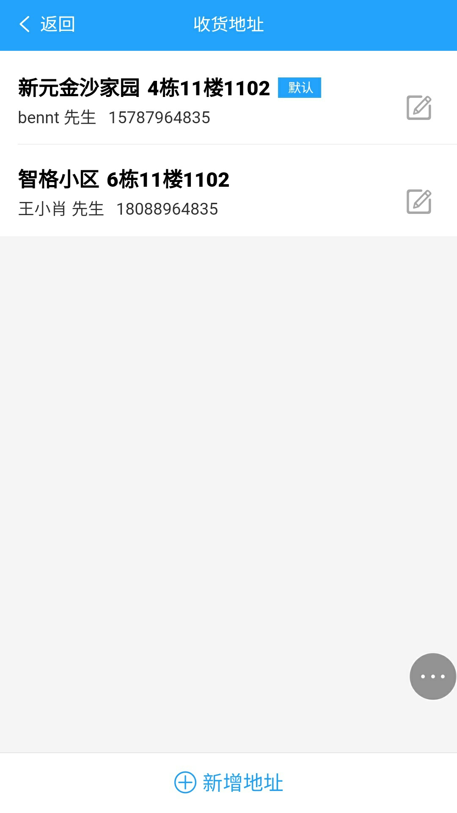

ceshi
# 主要内容
  本项目参照饿了么APP，属于高仿饿了么，部分功能尚未完善，尚在修改中。。。
  
 
## 技术栈
 vue2 + vuex + vue-router + vue-amap + mint-ui +webpack + ES6 + axios + sass + flex + 高德地图 
 
## 项目运行
    git clone git@github.com:bannerl/my-project.git

    cd my-project

    npm install
    
    npm run dev

    访问 http://localhost:8080
 a   
## 效果演示
  [戳这里](http://106.14.169.113:8080/#/index)（请用chrome手机模式预览）
    
### 移动端扫描下方二维码
 

## 截图
   
  
   
  
   
  
  
